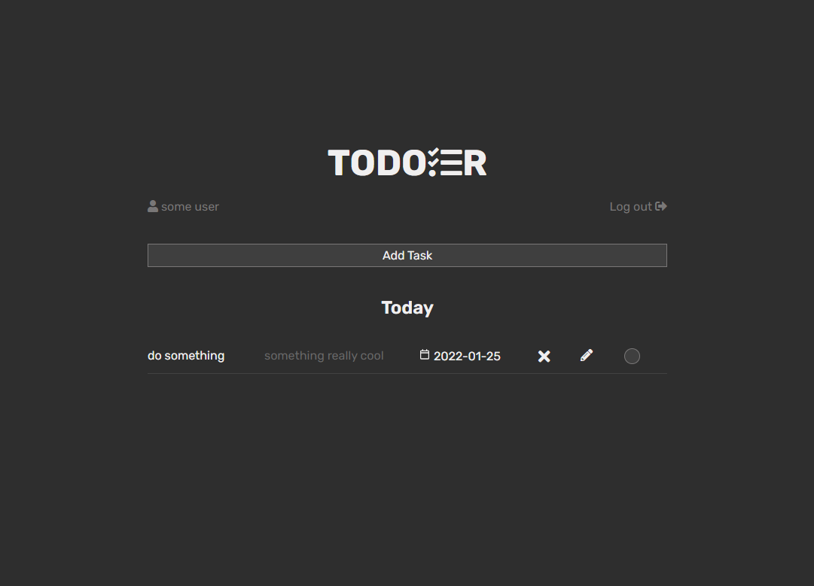

# u04 Todo App

## Description
**********************
This is a school assignment in the Backend programming module at Chas Academy, where we were supposed to create a Todo App. 

## Assignment Requirements
**********************
The Todo App should include:

- [x] A website written with PHP, HTML and CSS, along with a database in SQL (frontend JS is allowed, but is not a requirement).

- [x] An SQL database with tables and data

- [x] Handling task functionality
    - [x] <b>C</b>reate task
    - [x] <b>R</b>ead tasks
    - [x] <b>U</b>pdate tasks
        - [x] Complete task
    - [x] <b>D</b>elete task

- [x] At least one form that handles CRUD for the tasks

- [x] Design is not the main focus of the assignment, however basic design of forms and task list is desirable

- [x] Version control with git (not one commit at the end of the assignment, but regular commits with relevant messages).

## Prerequisites
**********************
PHP, Docker

## Manual
**********************
To try the app, 

- clone down the repository.

- run <code>docker-compose up</code>

- go to http://127.0.0.1/ in the browser
    - and create a new user, by clicking sign up and fill in the form

    OR

- go to localhost:8080/ in the browser
    - login to the database with details from the yaml file.
    - and import the demo data, provided in the repo, into the database.

- login 

- If you used the demo data you will see the demo task, if not you will not yet have any tasks to display

- Click "Add task" to create a new task
    - set a name 
    - add some extra information (optional) 
    - set a due date for the task (recommended) 

- Simply click the X to delete the task,
- the pen to edit the task 
- or tick the circle, to mark the task as completed

## Screenshot

